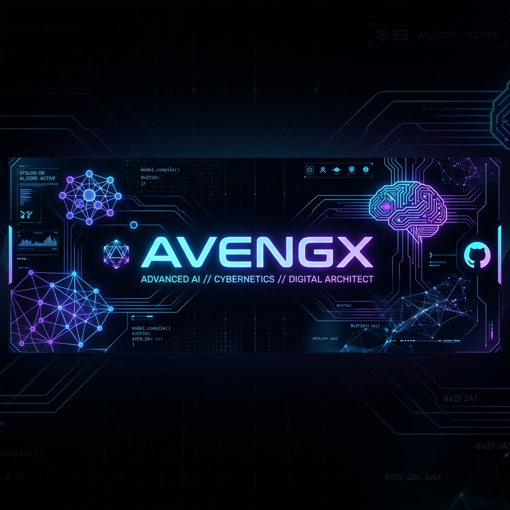

  

  <video src="https://raw.githubusercontent.com/AvengX/AvengX/main/hyprland_video.mp4" width="100%" autoplay loop muted playsinline></video>

  
  

<h1 align="center">Ayush Raj (AvengX)</h1>

  <b>Computer Science Student & Developer</b>

  

  <i>Computer Science student building structured software applications, performing data analytics, and exploring machine learning integrations.</i>

  

  

<h2 align="center">🌐 Core Diagnostics</h2>

<table align="center" width="90%">
  <tr>
    <td width="50%" valign="top">
      <h3>🚀 Background</h3>
      <ul>
        <li>🎓 <b>Education:</b> Computer Science Student</li>
        <li>🧠 <b>Core Focus:</b> Software Engineering & Data Analysis</li>
        <li>⚡ <b>Passionate About:</b> AI, full-stack, and performance optimization</li>
        <li>🤝 <b>Collaboration:</b> Open to technical contributions</li>
      </ul>
    </td>
    <td width="50%" valign="top">
      <h3>🧩 Algorithm Core</h3>
      <ul>
        <li>⚔️ <b>Problem Solving:</b> Loves solving DSA problems in C++</li>
        <li>📊 <b>Data Science:</b> Quantitative analysis using Pandas & NumPy</li>
        <li>💾 <b>Databases:</b> Relational database design & optimization</li>
        <li>🔍 <b>Interests:</b> Generative AI & system design</li>
      </ul>
    </td>
  </tr>
</table>

  

<h2 align="center">🛠️ Tech Stack & Arsenal</h2>

### 💻 Programming Languages

  
  
  
  
  

### 📊 Data Analysis & Libraries

  
  

### ⚙️ Database & Web

  
  
  

### ☁️ Infrastructure & Collaboration

  
  

  

<h2 align="center">💻 Featured Projects</h2>

<table width="100%">
  <tr>
    <td width="50%" valign="top">
      <h3>💼 Ayush-Raj-Portfolio</h3>
      
Personal developer portfolio site highlighting skills, projects, and contact avenues.

      

        <code>HTML5</code> <code>CSS3</code> <code>JavaScript</code>
      

      
    </td>
    <td width="50%" valign="top">
      <h3>🛒 gooba-website</h3>
      
Web application platform built for public hosting and dynamic interactive elements.

      

        <code>HTML5</code> <code>CSS3</code> <code>JavaScript</code>
      

      
      
    </td>
  </tr>
</table>

  

<h2 align="center">📊 GitHub Analytics & Diagnostics</h2>

  

  
  

  

  

  

<h2 align="center">🎮 Coding Profiles & Terminals</h2>

  
  
  

  

<h2 align="center">🧭 Current Trajectory</h2>

<table align="center" width="90%">
  <tr>
    <td align="center">
      <b>Learning & Optimizing Roadmap:</b>
    </td>
  </tr>
  <tr>
    <td>
      <ul>
        <li>📚 <b>Advanced Data Structures & Algorithms</b></li>
        <li>⚙️ <b>System Design Patterns</b></li>
        <li>🤖 <b>Generative AI integrations & LLMs</b></li>
      </ul>
    </td>
  </tr>
</table>

  

<h2 align="center">💬 Thought Loop</h2>

  <i>"The best way to predict the future is to invent it."</i>

  

<h2 align="center">⚡ System Buffer / Fun</h2>

  

  

  

  ⚡ Designed by AvengX | Powered by Cybernetic Systems ⚡

